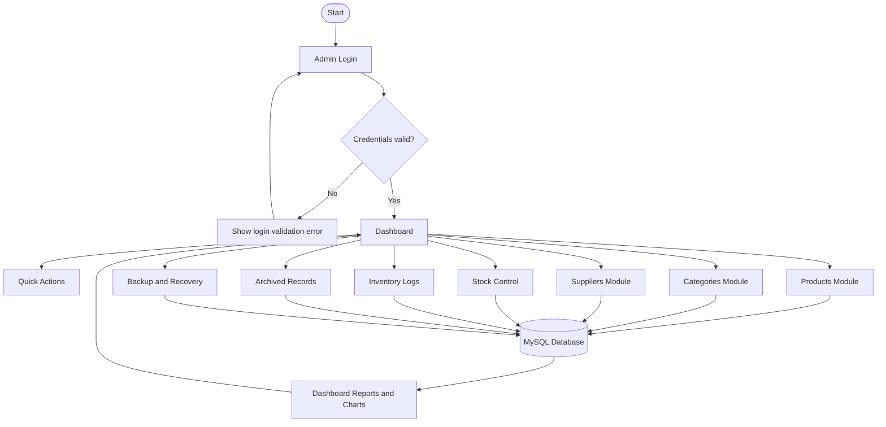
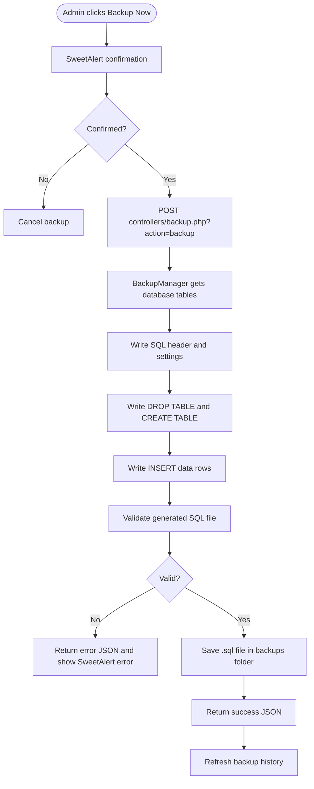
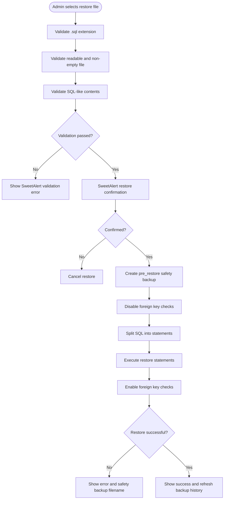

# GrocerEaseIMS Flowcharts

## Complete System Flow

```mermaid
flowchart TD
    A([Start]) --> B[Admin Login]
    B --> C{Credentials valid?}
    C -- No --> D[Show login validation error]
    D --> B
    C -- Yes --> E[Dashboard]
    E --> F[Quick Actions]
    E --> G[Products Module]
    E --> H[Categories Module]
    E --> I[Suppliers Module]
    E --> J[Stock Control]
    E --> K[Inventory Logs]
    E --> L[Archived Records]
    E --> M[Backup and Recovery]
    G --> N[(MySQL Database)]
    H --> N
    I --> N
    J --> N
    K --> N
    L --> N
    M --> N
    N --> O[Dashboard Reports and Charts]
    O --> E
```

## Backup Process Flow

```mermaid
flowchart TD
    A([Admin clicks Backup Now]) --> B[SweetAlert confirmation]
    B --> C{Confirmed?}
    C -- No --> D[Cancel backup]
    C -- Yes --> E[POST controllers/backup.php?action=backup]
    E --> F[BackupManager gets database tables]
    F --> G[Write SQL header and settings]
    G --> H[Write DROP TABLE and CREATE TABLE]
    H --> I[Write INSERT data rows]
    I --> J[Validate generated SQL file]
    J --> K{Valid?}
    K -- No --> L[Return error JSON and show SweetAlert error]
    K -- Yes --> M[Save .sql file in backups folder]
    M --> N[Return success JSON]
    N --> O[Refresh backup history]
```

## Recovery Process Flow

```mermaid
flowchart TD
    A([Admin selects restore file]) --> B[Validate .sql extension]
    B --> C[Validate readable and non-empty file]
    C --> D[Validate SQL-like contents]
    D --> E{Validation passed?}
    E -- No --> F[Show SweetAlert validation error]
    E -- Yes --> G[SweetAlert restore confirmation]
    G --> H{Confirmed?}
    H -- No --> I[Cancel restore]
    H -- Yes --> J[Create pre_restore safety backup]
    J --> K[Disable foreign key checks]
    K --> L[Split SQL into statements]
    L --> M[Execute restore statements]
    M --> N[Enable foreign key checks]
    N --> O{Restore successful?}
    O -- No --> P[Show error and safety backup filename]
    O -- Yes --> Q[Show success and refresh backup history]
```

